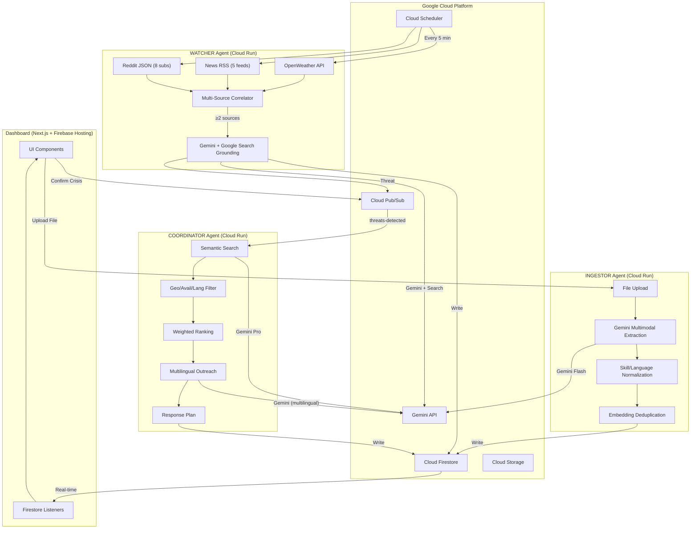

# PRAHARI-NGO — System Architecture

## Overview

Prahari uses a **four-agent architecture** where each agent is independently deployable on Cloud Run and communicates via Pub/Sub messaging. The Dispatch Optimizer uses Reinforcement Learning for optimal volunteer assignment. The dashboard observes all state changes in real-time via Firestore listeners.

## Architecture Diagram



## Data Flow

### 1. Ingestion Pipeline
```
File Upload → Gemini Multimodal → Extracted Volunteers → Normalize → Embed → Dedup → Firestore
```

### 2. Watch Cycle (every 5 minutes)
```
Weather + RSS + Reddit → Signal Collection → Correlation (≥2 sources) → Gemini Grounding → Threat Assessment → Pub/Sub + Firestore
```

### 3. Coordination Pipeline
```
Threat Pub/Sub → Semantic Search → Geo Filter → Availability → Language → Rank → Outreach → Plan → Firestore
```

## Firestore Collections

| Collection | Purpose | Key Fields |
|---|---|---|
| `volunteers` | Volunteer graph | name, skills[], location, languages[], embedding[] |
| `live_threats` | Active threats | type, severity, confidence, evidence_chain[], status |
| `response_plans` | Pre-staged/active plans | threat_id, matched_volunteers[], outreach_messages{} |
| `agent_activity` | Real-time agent log | agent, action, reasoning, duration_ms |

## Pub/Sub Topics

| Topic | Publisher | Subscriber |
|---|---|---|
| `threats-detected` | Watcher | Coordinator (pre-staged mode) |
| `crisis-confirmed` | Dashboard | Coordinator (active mode) |
| `ingestion-events` | Dashboard | Ingestor |

## Gemini Usage

| Agent | Model | Feature |
|---|---|---|
| Ingestor | Gemini 2.5 Flash | Multimodal extraction (text, PDF, image), JSON output |
| Watcher | Gemini 2.5 Flash | Google Search grounding for threat verification |
| Coordinator | Gemini 2.5 Pro | Function calling (7 tools), multilingual outreach |
| Shared | text-embedding-005 | 768-dim embeddings for semantic search + dedup |

## Kerala 2018 Replay

The replay system replays real public data streams from August 15, 2018:

```
06:12 → Weather alert (Alappuzha, 62mm rain)
07:03 → Reddit post (Kuttanad water rising)
07:34 → Mathrubhumi news (flood threat headline)
07:52 → Weather update (94mm rain — extreme)
08:01 → Reddit post (multiple districts affected)
08:14 → 🛡️ PRAHARI ALERT (confidence 78%)
08:17 → 14 volunteers pre-matched
08:47 → 📰 First news article (33 min LATER)
10:15 → 🏛️ Govt advisory (2 hr LATER)
```
